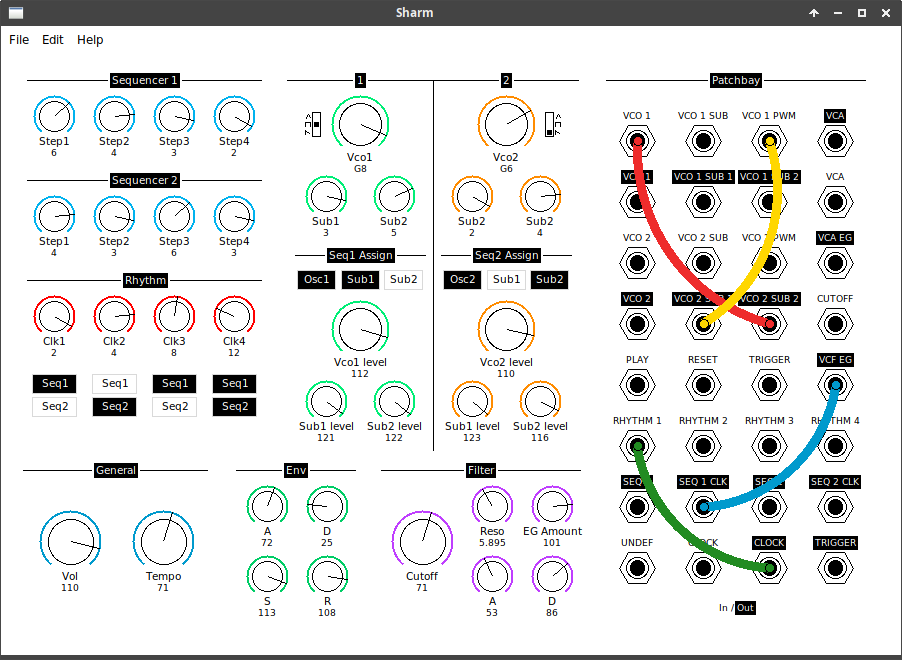

# Sharm
Sharm is an attempt to copy the behaviour of the Moog Shubharmonicon synthetizer.

### Set up:
Clone the repo
Create a new virtual environment
```console
$ virtualenv --python=python3.8 venv
```
Activate it
```console
$ source venv/bin/activate
```
Install the packages into it from the requirements file
```console
(venv) $ pip install -r requirements.txt
```
Run main.py in your terminal
```console
(venv) $ python main.py
```
### Short user guide:
* To close the main window, use the close button or press q.
* All parameters are saved in the file "State/state.sharm" when the window is closed.
* You can change the value of knobs using your mouse.
* You can also click on the title or the value of the knob and use arrow keys to change the value.
* On knobs controlling volume, you can press m to mute and unmute them.
* When a knob is selected, its value is colored in red, press q to deselect it.

### Improvements to come:
* Currently the file "State/state.sharm" stores all parameters when closing the window, a future version will add the possibility to save and load patches.
* Many minor corrections to be done.
* In a future version, a patchbay will be integrated, but this means recoding the audio lib. The interface should look like this :

