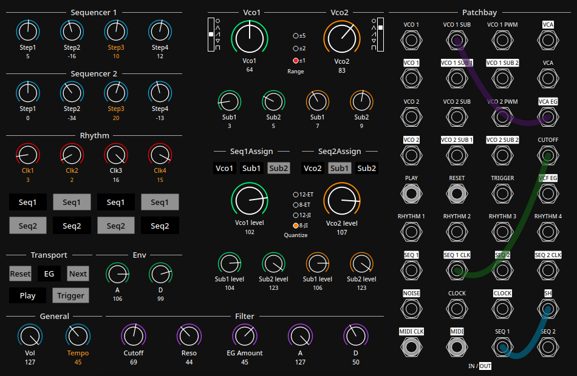

# Sharm
Sharm is an attempt to copy the behaviour of the Moog Shubharmonicon synthesizer.
Note : This branch is without cython extensions, so it should run slower than the main branch but you don't have to compile anything. 
If you experience many underruns, try changing the buffer size in the line 14 of audioLib/Audio.py.

### Set up:

Clone the repo
```console
$ git clone https://github.com/skpzk/Sharm.git
```
Move to the directory:
```console
$ cd Sharm
```
Create a new virtual environment (use your version of python, it should run at least on 3.7-3.9)
```console
$ virtualenv --python=python3.9 venv
```
Activate it
```console
$ source venv/bin/activate
```
Install the packages into it from the requirements file
```console
(venv) $ pip install -r requirements.txt
```
Run main.py in your terminal
```console
(venv) $ python main.py
```
### Short user guide:
* To close the main window, use the close button or press q.
* All parameters are saved in the file "state/state.sharm" when the window is closed.
* You can change the value of knobs using your mouse.
* You can also click on the title or the value of the knob and use arrow keys to change the value.
* On every knob, you can press m or double click to set its value to 0 (and press m again or double click to restore the previous value)
* When a knob is selected, its value is colored in red, press Esc to deselect it.
* Press spacebar to activate/deactivate Play.

### Improvements to come:
* Some patchpoints are not active yet (they are indicated by a light grey circle), they will be in a future version
* As of now, there is no midi integration, there will be an option to use a midi keyboard and a midi clock via the patchbay, and to set midi control change to knobs.


